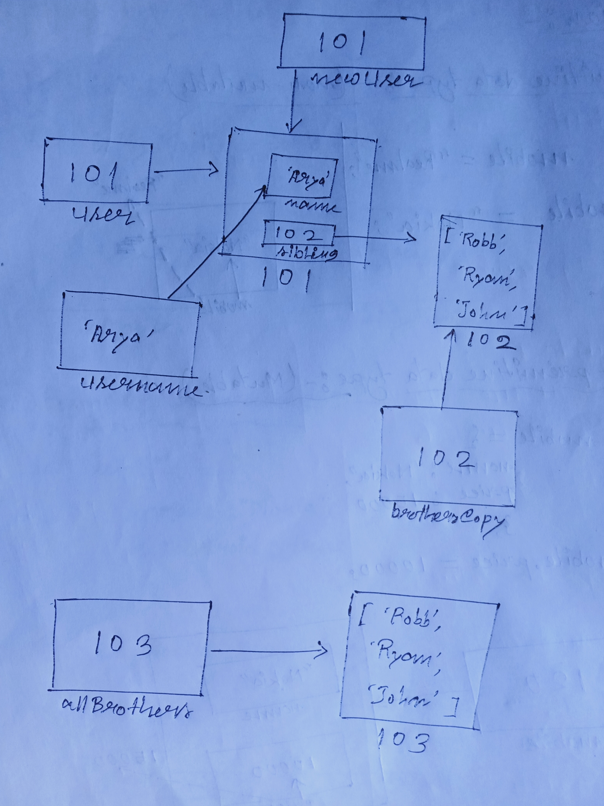

```js
let user = {
  name: 'Arya',
  sibling: ['Robb', 'Ryan', 'John'],
};
let allBrothers = ['Robb', 'Ryan', 'John'];
let brothersCopy = user.sibling;
let usename = user.name;
let newUser = user;
```

1. Memory representation

- Create the memory representation of the above snippet on notebook.
- Take a photo/screenshot and add it to the folder `code`

<!-- To add this image here use  -->


2. Answer the following with reason:

- `user == newUser;` // true and we have assigned newUser to user variable and user variablle has the value somewhere in the memory and now newUser will pointing to the same address
- `user === newUser;` // ture and we have assigned newUser to user variable and user variablle has the value somewhere in the memory and now newUser will pointing to the same address
- `user.name === newUser.name;` //  true and user and newuser have the same reference memory address
- `user.name == newUser.name;` // true and user and newuser have the same reference memory address
- `user.sibling == newUser.sibling;` // true and user and newuser have the same reference memory address
- `user.sibling === newUser.sibling;` // true and user and newuser have the same reference memory address
- `user.sibling == allBrothers;` // false and user.sibling and the allBrothers variable has different memory address 
- `user.sibling === allBrothers;` // false and user.sibling and the allBrothers variable has different memory address  
- `brothersCopy === allBrothers;` //  false and brothersCopy and the allBrothers variable has different memory address
- `brothersCopy == allBrothers;` // false and brothersCopy and the allBrothers variable has different memory address
- `brothersCopy == user.sibling;` // true and brothersCopy and user.sibling pointing to the same reference address or memory address
- `brothersCopy === user.sibling;` // true and brothersCopy and user.sibling pointing to the same reference address or memory address
- `brothersCopy[0] === user.sibling[0];` // true and brothersCopy and user.sibling pointing to the same reference address or memory address
- `brothersCopy[1] === user.sibling[1];` // true and brothersCopy and user.sibling pointing to the same reference address or memory address
- `user.sibling[1] === newUser.sibling[1];` // true and user and newUser pointing to the same reference address or memory address
